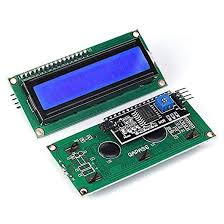
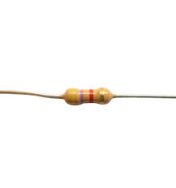
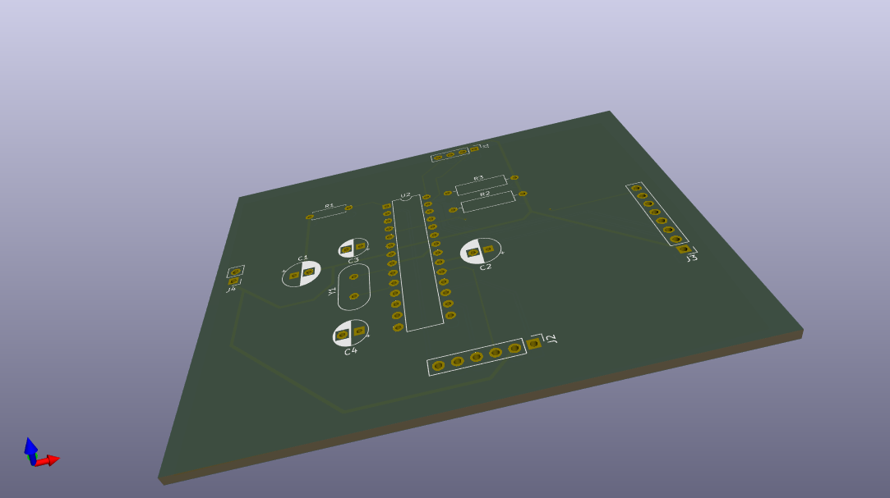
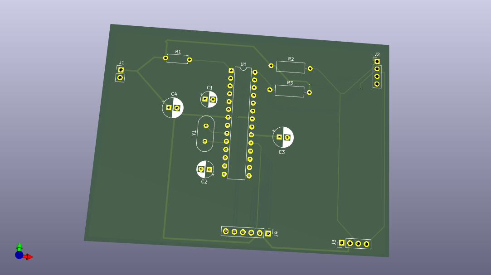

# BlackBox & Control Station - IFRI
## Data Reliability, Flight Resilience.

[](LICENSE)
[](https://www.arduino.cc/en/software)
[](https://ww1.microchip.com/downloads/en/DeviceDoc/Atmel-7810-Automotive-Microcontrollers-ATmega328P_Datasheet.pdf)
[](doc/trc2k25_infos/8bce113404fdd225ce17eafe8fa12a15.pdf)

---

## 🚀 Project Introduction

This project, developed as part of the **Electronic Test 2** for the **Tekbot Robotics Challenge 2K25 - RESILIENCE**, presents an innovative embedded system comprising a **BlackBox** and a **Control Station**. The main objective is to demonstrate expertise in embedded electronics, inter-system communication via I2C, and critical data management. The system is designed to record essential "vehicle" flight parameters (here simulated by an MPU-6050) and detect crash situations, while providing a ground-based monitoring and data recovery interface. This project highlights our commitment to **data reliability** and **in-flight system resilience**.

---

## ✨ Key Features

This modular system offers the following capabilities:

* **Flight Data Recording**: Real-time acquisition of acceleration (Z-axis) and orientation (Roll, Pitch) data via the MPU-6050 sensor on the BlackBox.
* **Intelligent Crash Detection**: Embedded algorithm on the BlackBox to detect a significant impact and freeze the last essential data.
* **Non-Volatile Storage**: Saving critical data (crash status, last flight values) in the BlackBox's EEPROM, ensuring persistence even after power loss.
* **Bidirectional I2C Communication**: Real-time transmission of flight data from the BlackBox (Master) to the Control Station (Slave).
* **Real-time Display**: Clear presentation of flight data on a dedicated LCD screen on the Control Station.
* **Visual Crash Indication**: Display of a distinct alert message on the Control Station screen upon impact detection.
* **Data Recovery Interface**: Ability to read recorded post-crash data from the BlackBox via a serial interface.

---

## 📐 System Architecture

The system is designed around two main modules, actively communicating to ensure monitoring and data recovery:

### **The BlackBox (Flight Recorder Unit)**

* **Role**: Autonomous unit responsible for flight data collection, crash detection, and storage.
* **Key Components**:
    * ATmega328P Microcontroller.
    * MPU-6050 Sensor (accelerometer and gyroscope).
    * EEPROM memory integrated into the microcontroller for non-volatile storage.
* **Operation**: Continuously reads data from the MPU-6050, calculates angles and vertical acceleration. An algorithm checks for crash conditions. In case of a crash, the last significant data is frozen and saved. It acts as an I2C master to send data to the Control Station.

### **The Control Station (Ground Monitoring Station)**

* **Role**: Ground interface for real-time visualization and system status monitoring.
* **Key Components**:
    * ATmega328P Microcontroller.
    * I2C LCD screen (16x2 or 20x4).
* **Operation**: Receives flight data from the BlackBox via I2C (as a slave). Dynamically displays flight parameters and switches to a "CRASH DETECTED" display upon an incident reported by the BlackBox.

### **Inter-Module Communication (I2C)**

Communication between the BlackBox and the Control Station is established via the I2C (Inter-Integrated Circuit) protocol.
* **BlackBox (Master)**: Initiates data transfers and periodically sends the `FlightData` structure.
* **Control Station (Slave)**: Passively listens on the I2C bus and receives data packets, updating its display accordingly.
This architecture ensures efficient communication with a minimum number of wires, ideal for embedded systems.

---

## 🛠️ Hardware Used

This project relies on standard and accessible electronic components. Here is a detailed list of the hardware required to build and implement the "BlackBox & Control Station" system.

### **Key Components Common to Both Modules:**

* **ATmega328P Microcontroller**
    * **Description**: The core of each module, responsible for executing the firmware. For prototyping, an Arduino Uno board can be used.
    * **Datasheet**: [ATmega328P Datasheet](https://ww1.microchip.com/downloads/en/DeviceDoc/Atmel-7810-Automotive-Microcontrollers-ATmega328P_Datasheet.pdf)
    
* **Breadboards & Jumper Wires**
    * **Description**: For initial prototyping and temporary interconnections.
    
* **USB to Serial Adapter (FTDI or Arduino Uno as programmer)**
    * **Description**: Essential for code upload and serial communication (debugging) with bare ATmega chips.
    * **Datasheet (FT232RL example)**: [FT232RL Datasheet](https://ftdichip.com/wp-content/uploads/2020/08/DS_FT232R.pdf)
    

### **Components Specific to the BlackBox:**

* **MPU-6050 Sensor Module (Gyroscope + Accelerometer)**
    * **Description**: The 6 DOF (Degrees of Freedom) sensor that provides orientation and acceleration data for flight and crash detection.
    * **Datasheet (MPU-6050 Chip)**: [MPU-6050 Datasheet](https://www.cdiweb.com/datasheets/invensense/MPU-6050_DataSheet_V3.4.pdf)
    

### **Components Specific to the Control Station:**

* **16x2 or 20x4 LCD Screen with I2C Module**
    * **Description**: The visual interface for real-time display of flight data and crash status. The I2C adapter greatly simplifies wiring.
    * **Datasheet (HD44780 Example)**: [HD44780 Datasheet](https://www.sparkfun.com/datasheets/LCD/HD44780.pdf)
    * **Datasheet (PCF8574 I2C Example)**: [PCF8574 Datasheet](https://www.ti.com/lit/ds/symlink/pcf8574.pdf)
    

### **Components for PCB Design (if applicable):**

* **16 MHz Crystal Oscillator and 22 pF Capacitors (if ATmega328P standalone)**
    * **Description**: Necessary for stable clock operation of the ATmega328P when used alone on a custom PCB.
    
* **Pull-up Resistors (4.7kΩ, for I2C if not integrated into modules)**
    * **Description**: Ensure proper idle voltage on the SDA and SCL lines of the I2C bus.
    

---

## 💻 Software (Firmware)

The core of this project lies in the embedded firmware, developed with the Arduino IDE for ATmega328P microcontrollers. The code is structured to maximize clarity and modularity.

The complete source code is available in the [`firmware/`](firmware/) folder.

### **1. BlackBox Firmware (`cube_firmware.ino`)**

* **Path**: [`firmware/cube_firmware/cube_firmware.ino`](./firmware/cube_firmware/cube_firmware.ino)
* **Main Role**: MPU-6050 data acquisition, crash detection, critical data saving to EEPROM, and I2C transmission to the Control Station.

#### **Key Functions and Their Role:**

* **`setup()`**: Initializes the MPU-6050 and the I2C bus. Manages the autonomous system reset logic after a crash (detected by a power cycle) and configures the MPU-6050's "Data Ready" interrupt.
* **`loop()`**: The program's core. Continuously reads data from the MPU-6050, applies the crash detection logic, manages logging into the EEPROM circular buffer, and sends data to the Control Station via I2C.
* **`FlightData` (structure)**: Defines the data structure (Roll, Pitch, Accel Z, Status) exchanged between the BlackBox and the Control Station.
    
* **`handleSerialRecovery()`**: Allows retrieving data recorded in EEPROM via the serial port after a crash, upon sending a specific command.
* **`handleMPUInterrupt()`**: Interrupt management function for the MPU-6050 (activates a flag for data reading).

### **2. Control Station Firmware (`station_firmware.ino`)**

* **Path**: [`firmware/station_firmware/station_firmware.ino`](./firmware/station_firmware/station_firmware.ino)
* **Main Role**: Receiving I2C data from the BlackBox and displaying it on the LCD screen.

#### **Key Functions and Their Role:**

* **`setup()`**: Initializes the microcontroller as an I2C slave and configures the LCD screen.
* **`loop()`**: Manages the LCD display update based on received data and crash status (Normal or "CRASH !!!").
* **`receiveEvent(int numBytes)`**: I2C callback function. It is automatically called when data is received from the BlackBox and reads it into the `FlightData` structure.
* **`FlightData` (structure)**: Uses the same structure as the BlackBox to correctly interpret received data.

---

## 🔩 Assembly and Configuration Guide

This guide will walk you step-by-step through assembling the "BlackBox" and "Control Station" modules and configuring them for proper operation.

### **1. Preparing the Development Environment**

Ensure you have the Arduino IDE development environment configured:
* **Download and install the Arduino IDE** from [https://www.arduino.cc/en/software](https://www.arduino.cc/en/software).
* **Install necessary libraries** via the IDE's "Library Manager" (`Sketch > Include Library > Manage Libraries...`):
    * `Adafruit MPU6050`
    * `Adafruit Unified Sensor` (MPU6050 dependency)
    * `LiquidCrystal I2C` (by Frank de Brabander)

### **2. Assembling the "BlackBox" Module**

The "BlackBox" module includes an ATmega328P microcontroller (or Arduino Uno board for prototyping) and the MPU-6050 sensor.

#### **Wiring Diagram (Breadboard Prototyping)**

This diagram illustrates the minimal connections for the BlackBox's operation on a breadboard.

* **ATmega328P (on Arduino Uno board or standalone)**
* **MPU-6050**
    * `VCC` -> `5V` (or `3.3V` if your MPU-6050 module is 3.3V compatible)
    * `GND` -> `GND`
    * `SDA` -> `A4` (or dedicated `SDA` if bare ATmega328P)
    * `SCL` -> `A5` (or dedicated `SCL` if bare ATmega328P)
    * `INT` -> `D2` (for Data Ready interrupt)

* **BlackBox KiCad Schematic:**
    
    *KiCad File:* [`hardware/cube_pcb/cube_pcb.kicad_sch`](./hardware/cube_pcb/cube_pcb.kicad_sch)

* **BlackBox PCB 3D Visualization:**
    
    
    *KiCad File:* [`hardware/cube_pcb/cube_pcb.kicad_pcb`](./hardware/cube_pcb/cube_pcb.kicad_pcb)

* **Prototyping Assembly Photo (Optional, if available):**
    

#### **Uploading the BlackBox Firmware**

1.  Open the file [`cube_firmware.ino`](./firmware/cube_firmware/cube_firmware.ino) in the Arduino IDE.
2.  Ensure you have selected the correct board (e.g., "Arduino Uno") and COM/USB port.
3.  Click "Upload" (right arrow button) to compile and send the code to your microcontroller.

### **3. Assembling the "Control Station" Module**

The "Control Station" module includes an ATmega328P microcontroller (or Arduino Uno board) and an I2C LCD screen.

#### **Wiring Diagram (Breadboard Prototyping)**

This diagram illustrates the minimal connections for the Control Station's operation on a breadboard.

* **ATmega328P (on Arduino Uno board or standalone)**
* **I2C LCD Screen**
    * `VCC` -> `5V`
    * `GND` -> `GND`
    * `SDA` -> `A4` (or dedicated `SDA` if bare ATmega328P)
    * `SCL` -> `A5` (or dedicated `SCL` if bare ATmega328P)

* **Control Station KiCad Schematic:**
    
    *KiCad File:* [`hardware/station_pcb/station_pcb.kicad_sch`](./hardware/station_pcb/station_pcb.kicad_sch)

* **Control Station PCB 3D Visualization:**
    
    
    *KiCad File:* [`hardware/station_pcb/station_pcb.kicad_pcb`](./hardware/station_pcb/station_pcb.kicad_pcb)

* **Prototyping Assembly Photo (Optional, if available):**
    

#### **Uploading the Control Station Firmware**

1.  Open the file [`station_firmware.ino`](./firmware/station_firmware/station_firmware.ino) in the Arduino IDE.
2.  Ensure you have selected the correct board and COM/USB port.
3.  Click "Upload".

### **4. Configuring the I2C Address**

* Verify that the I2C address defined for the Control Station in the code (`STATION_ADDRESS`) matches the one used by the BlackBox for data transmission. By default, it is set to `8`.
    ```cpp
    // In both cube_firmware.ino and station_firmware.ino
    const int STATION_ADDRESS = 8;
    ```
    If you are using a full Arduino Uno board, SDA (A4) and SCL (A5) pins are generally standard. If using a bare ATmega328P, ensure pins A4 and A5 are connected to SDA and SCL respectively.

### **5. Powering the Modules**

* Both modules (BlackBox and Control Station) require a stable 5V power supply.
* Ensure that the GND (grounds) of both modules are interconnected for proper I2C communication.

---

## 🚀 Operation and Usage

Once assembled and the firmwares uploaded to each module, your "BlackBox & Control Station" system is ready to operate. Follow this guide to understand its behavior and interact with it.

### **1. System Startup**

1.  **Power both modules** (BlackBox and Control Station) simultaneously or sequentially. Ensure their grounds (GND) are interconnected.
2.  The **Control Station** will briefly display "Station OK" on the LCD screen, then enter a data waiting mode.
3.  The **BlackBox** will initialize the MPU-6050 and begin acquiring data. If a crash was previously detected and recorded, the BlackBox will automatically reset the crash status in EEPROM, preparing the system for a new flight. You will see startup messages on the serial monitor if connected.

### **2. Normal Operation Mode**

In normal operation mode, the BlackBox continuously acquires orientation and acceleration data from the MPU-6050 and sends it to the Control Station.

* **Control Station Display**: The Control Station's LCD screen will display real-time Roll (R:), Pitch (P:), and Z-axis Acceleration (AccelZ:) values measured by the BlackBox. These values should change according to BlackBox movements.

    

### **3. Crash Detection**

The system is designed to detect a significant impact, simulating a crash, based on MPU-6050 acceleration data.

* **Trigger**: When the total acceleration exceeds a predefined threshold (`CRASH_THRESHOLD_G` in the BlackBox firmware, currently 8G), the BlackBox detects a crash.
* **BlackBox Behavior**:
    * The crash flag is activated.
    * The last relevant flight data is frozen and permanently stored in EEPROM memory.
    * The BlackBox stops recording new flight data and enters a recovery mode, awaiting potential commands via the serial port.
* **Control Station Behavior**:
    * As soon as it receives the crash status from the BlackBox, the LCD screen switches to display a clear alert message: "!!! CRASH !!!" on the first line and "DATA FROZEN" on the second.

    

### **4. Post-Crash Data Recovery**

After a crash, crucial data is stored in the BlackBox's EEPROM. It can be recovered via a serial connection.

1.  **Connect the BlackBox** to your computer via the USB to Serial adapter (or Arduino Uno's USB cable).
2.  **Open the Serial Monitor** in the Arduino IDE (or a serial terminal of your choice), ensuring the baud rate is set to `9600`.
3.  **Send the exact command**: `LIRE_DONNEES_CRASH` (followed by a newline/carriage return; ensure "Newline" is selected in the serial monitor options).
4.  The BlackBox will respond by displaying the recorded data (Roll, Pitch, AccelZ) in CSV format, allowing for later analysis.

    

---

## ✅ Results and Demonstration

This project has been rigorously tested to validate its key functionalities, from data acquisition to crash detection and recovery.

### **1. Functional Tests**

Unit and integration tests have been performed for each component and module. Detailed results of these tests are available in the [`tests/results/`](./tests/results/) folder.

* **EEPROM Test (`eeprom_test`)**: Validation of non-volatile data reading and writing.
    * [EEPROM Test Results](./tests/results/eeprom_test/results.txt)
* **I2C Communication Test (`i2c_master_to_slave`)**: Verification of bidirectional transmission between the BlackBox (Master) and the Control Station (Slave).
    * [I2C Test Results](./tests/results/i2c_master_to_slave/results.txt)
* **I2C LCD Screen Test (`lcd_i2c_test`)**: Confirmation of correct information display.
    * [LCD I2C Test Results](./tests/results/lcd_i2c_test/results.txt)
* **MPU-6050 Sensor Test (`mpu6050_test`)**: Verification of accurate acceleration and gyroscope data acquisition.
    * [MPU-6050 Test Results](./tests/results/mpu6050_test/results.txt)

### **2. Full System Demonstration**

The most compelling elements are the visuals of the system in action. The videos and GIFs below illustrate the behavior of the "BlackBox & Control Station" in its different states.

* **Normal Mode Demonstration:**
    * Visualize the dynamic display of roll, pitch, and Z-axis acceleration data on the Control Station screen based on BlackBox movements.
    
* **Crash Detection Demonstration:**
    * Observe the Control Station display transition to "!!! CRASH !!!" upon impact detection.
    
* **Post-Crash Data Recovery Demonstration:**
    * Illustration of the connection procedure and sending the command to retrieve essential data stored in EEPROM via the serial monitor.
    

**Note**: For a complete and interactive demonstration, please refer to the project presentation video (link below).

* **[Link to Full Demo Video on YouTube / Vimeo]**

---

## 💡 Possible Improvements

The "BlackBox & Control Station" system is functional and meets its initial objectives. However, several avenues for improvement can be explored to enhance its capabilities, robustness, and usability.

### **1. BlackBox Module Enhancements**

* **Advanced EEPROM Management**: Implement more sophisticated EEPROM circular buffer management to ensure data integrity even in case of power loss during writing, or to add timestamps to recordings.
* **Additional Data Acquisition**: Integrate other sensors (GPS for crash location, barometer for altitude, temperature/humidity sensor) to enrich flight data.
* **Power Consumption Optimization**: Implement low-power modes to extend the BlackBox's autonomy, essential for embedded applications.
* **Crash Detection Precision**: Refine the crash detection algorithm using filtering techniques (Kalman filter, complementary filter) for the MPU-6050, or by integrating dynamic thresholds.

### **2. Control Station Module Enhancements**

* **Enriched User Interface**: Replace the LCD screen with an OLED or TFT graphical display for richer visuals (graphs, intuitive menus, icons).
* **Received Data Storage**: Add an SD card or external EEPROM so the Control Station can record a history of real-time received data, not just post-crash data.
* **Extended Connectivity**:
    * Integration of a Wi-Fi (ESP8266/ESP32) or Bluetooth module for wireless communication with a PC or smartphone, allowing for more advanced visualization or remote transmission.
    * Set up an embedded web server on the ESP32 to visualize data via a browser.
* **Audio/Visual Alerts**: Add a buzzer or LEDs for more visible or audible alerts in case of a crash.

### **3. Communication and Robustness Enhancements**

* **Checksum/CRC for I2C**: Add an error-checking mechanism (checksum or CRC) to I2C packets to ensure transmitted data integrity.
* **Sensor Redundancy**: For critical applications, consider using multiple sensors and data fusion logic for greater reliability.
* **Enclosure and Mounting**: Design and 3D print a robust and compact enclosure for each module, protecting the electronics and facilitating integration into a drone/robot.
* **FOTA (Firmware Over-The-Air) Updates**: If Wi-Fi connectivity is added, enable remote firmware updates to facilitate maintenance and evolution.

---

## ❓ Troubleshooting (FAQ)

This section gathers common problems you might encounter during assembly, uploading, or using the system, along with their solutions.

### **Firmware Upload Issues**

* **Q: Error "avrdude: ser_open(): can't open device" or "Port not found."**
    * **A:** Verify that the correct COM/USB port is selected in the Arduino IDE (`Tools > Port`). Ensure the USB to Serial adapter (or Arduino Uno used as a programmer) is correctly connected and that drivers (e.g., FTDI, CH340) are installed on your computer.
* **Q: Error "stk500_getsync(): not in sync: resp=0x00."**
    * **A:** This often indicates a communication problem between the IDE and the microcontroller.
        * Verify that the correct board is selected (`Tools > Board`).
        * Ensure the ATmega328P is correctly wired for upload (including TX/RX, Reset connections).
        * Try holding down the "Reset" button on the Arduino (or disconnecting/reconnecting GND on the bare ATmega) just before the upload begins (just after compilation).
* **Q: The code compiles but nothing happens on the board.**
    * **A:** Check the board's power supply and `GND` connections. If using a standalone ATmega328P, ensure the 16 MHz crystal oscillator and its 22 pF capacitors are correctly connected and that the bootloader is properly burned.

### **I2C Communication Issues**

* **Q: The Control Station's LCD screen remains blank or shows squares.**
    * **A:**
        * Check the LCD screen's wiring, especially SDA, SCL, VCC, and GND.
        * Ensure the contrast potentiometer on the back of the LCD's I2C module is correctly adjusted (turn it with a small screwdriver).
        * Verify the I2C address of your LCD module. The default address in the code (`0x27`) is the most common, but some modules use `0x3F`. You can use an "I2C scanner" sketch (search "Arduino I2C scanner" online) to find your LCD's actual address.
* **Q: The Control Station doesn't display data or shows erroneous values.**
    * **A:**
        * Ensure the SDA and SCL pins of both the BlackBox and Control Station are correctly connected (SDA to SDA, SCL to SCL).
        * **Make sure the grounds (GND) of both modules are interconnected!** This is a very common I2C error.
        * Verify that the firmwares for both modules are properly uploaded and match the expected versions.
        * Confirm that `STATION_ADDRESS` is identical in both codes.
        * Are pull-up resistors (4.7kΩ) on SDA and SCL present? They are often integrated into modules or Arduino boards but might be necessary if using a bare ATmega.

### **MPU-6050 Sensor Issues**

* **Q: The MPU-6050 doesn't return data or displays fixed/erroneous values.**
    * **A:**
        * Check the MPU-6050's wiring (VCC, GND, SDA, SCL, INT).
        * Confirm the power supply (VCC) of the MPU-6050. Some modules are 3.3V, others have a 5V regulator integrated.
        * Ensure the MPU-6050's I2C address is correct (`0x68` or `0x69` if the AD0 pin is pulled HIGH). The code uses 0x68.

### **Crash Detection and EEPROM Issues**

* **Q: The system doesn't detect crashes or detects "false positives."**
    * **A:** The crash detection threshold `CRASH_THRESHOLD_G` may require adjustment. This value will depend on the desired sensitivity and the type of impact you want to simulate. Start with lower values and gradually increase them.
    * Check sensor stability. Excessive vibrations during normal flight can be interpreted as false positives.
* **Q: Data is not saved to EEPROM or recovered data is corrupted.**
    * **A:**
        * Ensure you are using the standard Arduino EEPROM library.
        * Verify the size of your `FlightData` struct and the EEPROM address management in the code. `EEPROM.put()` and `EEPROM.get()` functions automatically handle the structure size, but addresses (`EEPROM_CRASH_FLAG_ADDR`, `EEPROM_CRASH_ADDR_ADDR`) must be correctly defined to avoid overlaps.

---

## 👏 Conclusion

The "BlackBox & Control Station - IFRI" system represents a comprehensive and robust solution for acquiring, monitoring, and recovering critical data in embedded environments. Developed with rigor for the **Tekbot Robotics Challenge 2K25 - RESILIENCE**, it demonstrates our expertise in electronics, embedded programming, and inter-system communication. We hope this project serves as a solid foundation for future explorations and innovations in robotics and embedded systems.

---

## 📄 License

This project is distributed under the MIT License. You are free to use, modify, and distribute it under the terms of this license.

For more details, refer to the [`LICENSE`](LICENSE) file at the root of this repository.

---

## 🙏 Acknowledgments

We extend our gratitude to all who contributed to the realization of this project, including:
* **[Your Name / Team Members]** for the hard work and perseverance.
* **IFRI** for the learning environment and resources provided.
* **Sensei AI** for valuable guidance and mentorship throughout this challenge.
* The Arduino and Tekbot communities for their inspiration and resources.