# BlackBox & Control Station - IFRI
## Fiabilité des données, résilience en vol.

[](LICENSE) [](https://www.arduino.cc/en/software) [](https://ww1.microchip.com/downloads/en/DeviceDoc/Atmel-7810-Automotive-Microcontrollers-ATmega328P_Datasheet.pdf) [](doc/trc2k25_infos/8bce113404fdd225ce17eafe8fa12a15.pdf) 

---

## 🚀 Introduction au Projet

Ce projet, développé dans le cadre du **Test 2 Électronique** du **Tekbot Robotics Challenge 2K25 - RESILIENCE**, présente un système embarqué innovant composé d'une **Boîte Noire** et d'une **Station de Contrôle**. L'objectif principal est de démontrer une expertise en électronique embarquée, en communication inter-systèmes via I2C, et en gestion de données critiques. Le système est conçu pour enregistrer les paramètres de vol essentiels d'un "véhicule" (ici simulé par un MPU-6050) et détecter les situations de crash, tout en offrant une interface de suivi et de récupération des données au sol. Ce projet souligne notre engagement envers la **fiabilité des données** et la **résilience des systèmes en vol**.

---

## ✨ Fonctionnalités Clés

Ce système modulaire offre les capacités suivantes :

* **Enregistrement de Données de Vol** : Acquisition en temps réel des données d'accélération (axe Z) et d'orientation (Roll, Pitch) via le capteur MPU-6050 sur la Boîte Noire.
* **Détection de Crash Intelligente** : Algorithme embarqué sur la Boîte Noire pour détecter un impact significatif et figer les dernières données essentielles.
* **Stockage Non Volatil** : Sauvegarde des données critiques (état de crash, dernières valeurs de vol) dans la mémoire EEPROM de la Boîte Noire, assurant leur persistance même après une perte de puissance.
* **Communication I2C Bidirectionnelle** : Transmission en temps réel des données de vol de la Boîte Noire (Maître) vers la Station de Contrôle (Esclave).
* **Affichage en Temps Réel** : Présentation claire des données de vol sur un écran LCD dédié sur la Station de Contrôle.
* **Indication Visuelle de Crash** : Affichage d'un message d'alerte distinct sur l'écran de la Station de Contrôle en cas de détection d'impact.
* **Interface de Récupération des Données** : Possibilité de lire les données enregistrées post-crash depuis la Boîte Noire via une interface série.

---

## 📐 Architecture du Système

Le système est conçu autour de deux modules principaux, communiquant activement pour assurer la surveillance et la récupération des données :

### **La Boîte Noire (Flight Recorder Unit)**

* **Rôle :** Unité autonome responsable de la collecte des données de vol, de la détection de crash et du stockage.
* **Composants Clés :**
    * Microcontrôleur ATmega328P.
    * Capteur MPU-6050 (accéléromètre et gyroscope).
    * Mémoire EEPROM intégrée au microcontrôleur pour le stockage non volatil.
* **Fonctionnement :** Lit en continu les données du MPU-6050, calcule les angles et l'accélération verticale. Un algorithme vérifie les conditions de crash. En cas de crash, les dernières données significatives sont figées et sauvegardées. Elle agit comme maître I2C pour envoyer les données à la Station de Contrôle.

### **La Station de Contrôle (Ground Monitoring Station)**

* **Rôle :** Interface au sol pour la visualisation en temps réel et la surveillance de l'état du système.
* **Composants Clés :**
    * Microcontrôleur ATmega328P.
    * Écran LCD I2C (16x2).
* **Fonctionnement :** Reçoit les données de vol de la Boîte Noire via I2C (en tant qu'esclave). Affiche dynamiquement les paramètres de vol et bascule vers un affichage "CRASH DETECTÉ" en cas d'incident signalé par la Boîte Noire.

### **Communication Inter-Modules (I2C)**

La communication entre la Boîte Noire et la Station de Contrôle est établie via le protocole I2C (Inter-Integrated Circuit).
* **Boîte Noire (Maître) :** Initie les transferts de données et envoie périodiquement la structure `FlightData`.
* **Station de Contrôle (Esclave) :** Écoute passivement sur le bus I2C et reçoit les paquets de données, mettant à jour son affichage en conséquence.
Cette architecture assure une communication efficace avec un minimum de fils, idéale pour des systèmes embarqués.

---

## 🛠️ Matériel Utilisé

Ce projet s'appuie sur des composants électroniques standards et accessibles. Voici la liste détaillée du matériel nécessaire pour construire et mettre en œuvre le système "BlackBox & Control Station".

### **Composants Clés Communs aux Deux Modules :**

* **Microcontrôleur ATmega328P**
    * **Description :** Le cœur de chaque module, responsable de l'exécution du firmware. Pour le prototypage, une carte Arduino Uno peut être utilisée.
    * **Datasheet :** [ATmega328P Datasheet](https://ww1.microchip.com/downloads/en/DeviceDoc/Atmel-7810-Automotive-Microcontrollers-ATmega328P_Datasheet.pdf)
     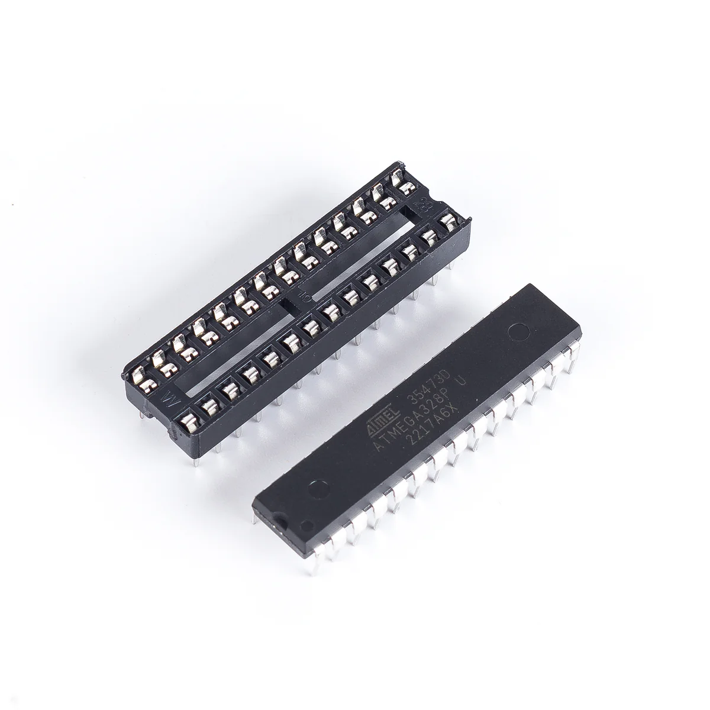 
    * **Breadboards & Câbles Jumper**
    * **Description :** Pour le prototypage initial et les interconnexions temporaires.
      
    * **Adaptateur USB vers Série (FTDI ou Arduino Uno comme programmeur)**
    * **Description :** Essentiel pour le téléversement du code et la communication série (débogage) avec les ATmega nus.
    * **Datasheet (FT232RL exemple) :** [FT232RL Datasheet](https://ftdichip.com/wp-content/uploads/2020/08/DS_FT232R.pdf)
    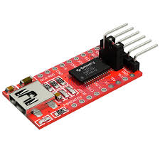 
    
### **Composants Spécifiques à la Boîte Noire :**

* **Module Capteur MPU-6050 (Gyroscope + Accéléromètre)**
    * **Description :** Le capteur 6 DOF (Degrees of Freedom) qui fournit les données d'orientation et d'accélération pour la détection de vol et de crash.
    * **Datasheet (Puce MPU-6050) :** [MPU-6050 Datasheet](https://www.cdiweb.com/datasheets/invensense/MPU-6050_DataSheet_V3.4.pdf)
      
    
### **Composants Spécifiques à la Station de Contrôle :**

* **Écran LCD 16x2 ou 20x4 avec Module I2C**
    * **Description :** L'interface visuelle pour afficher en temps réel les données de vol et le statut de crash. L'adaptateur I2C simplifie grandement le câblage.
    * **Datasheet (Exemple HD44780) :** [HD44780 Datasheet](https://www.sparkfun.com/datasheets/LCD/HD44780.pdf)
    * **Datasheet (Exemple PCF8574 I2C) :** [PCF8574 Datasheet](https://www.ti.com/lit/ds/symlink/pcf8574.pdf)
     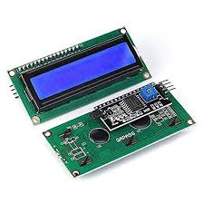 

### **Composants pour la Conception PCB (si applicable) :**

* **Quartz 16 MHz et Condensateurs 22 pF (si ATmega328P standalone)**
    * **Description :** Nécessaires pour le fonctionnement stable de l'horloge de l'ATmega328P lorsqu'il est utilisé seul sur un PCB personnalisé.
     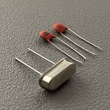 
    * **Résistances de Pull-up (4.7kΩ, pour I2C si non intégrées aux modules)**
    * **Description :** Assurent la bonne tension de repos sur les lignes SDA et SCL du bus I2C.
     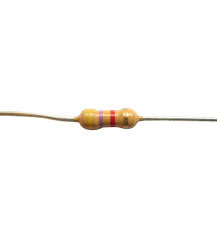

---

## 💻 Logiciel (Firmware)

Le cœur de ce projet réside dans le firmware embarqué, développé avec l'Arduino IDE pour les microcontrôleurs ATmega328P. Le code est structuré pour maximiser la clarté et la modularité.

Le code source complet est disponible dans le dossier [`firmware/`](firmware/).

### **1. Firmware de la Boîte Noire (`cube_firmware.ino`)**

* **Chemin :** `firmware/cube_firmware/cube_firmware.ino`
* **Rôle Principal :** Acquisition des données du MPU-6050, détection de crash, sauvegarde des données critiques en EEPROM, et transmission I2C vers la Station de Contrôle.

#### **Fonctions Clés et Leur Rôle :**

* **`setup()`** : Initialisation du MPU-6050 et du bus I2C. Gère la logique de réinitialisation autonome du système après un crash (détectée par un cycle d'alimentation) et configure l'interruption "Data Ready" du MPU-6050.
* **`loop()`** : Cœur du programme. Lit en continu les données du MPU-6050, applique la logique de détection de crash, gère l'enregistrement dans le buffer circulaire de l'EEPROM, et envoie les données à la Station de Contrôle via I2C.
* **`FlightData` (structure)** : Définit la structure des données (Roll, Pitch, Accel Z, Statut) échangées entre la Boîte Noire et la Station de Contrôle.
     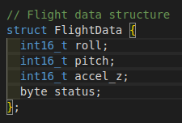 
    * **`handleSerialRecovery()`** : Permet de récupérer les données enregistrées en EEPROM via le port série après un crash, sur envoi d'une commande spécifique.
* `handleMPUInterrupt()`: Fonction de gestion de l'interruption du MPU-6050 (active un flag pour la lecture des données).

### **2. Firmware de la Station de Contrôle (`station_firmware.ino`)**

* **Chemin :** `firmware/station_firmware/station_firmware.ino`
* **Rôle Principal :** Réception des données I2C de la Boîte Noire et affichage sur l'écran LCD.

#### **Fonctions Clés et Leur Rôle :**

* **`setup()`** : Initialise le microcontrôleur en tant qu'esclave I2C et configure l'écran LCD.
* **`loop()`** : Gère la mise à jour de l'affichage LCD en fonction des données reçues et du statut de crash (Normal ou "CRASH !!!").
* **`receiveEvent(int numBytes)`** : Fonction de rappel I2C. Elle est automatiquement appelée lorsque des données sont reçues de la Boîte Noire et les lit dans la structure `FlightData`.
* **`FlightData` (structure)** : Utilise la même structure que la Boîte Noire pour interpréter correctement les données reçues.

---

## 🔩 Guide d'Assemblage et de Configuration

Ce guide vous accompagnera étape par étape pour assembler les modules "Boîte Noire" et "Station de Contrôle" et les configurer pour leur bon fonctionnement.

### **1. Préparation de l'Environnement de Développement**

Assurez-vous d'avoir l'environnement de développement Arduino IDE configuré :
* **Téléchargez et installez l'Arduino IDE** depuis [https://www.arduino.cc/en/software](https://www.arduino.cc/en/software).
* **Installez les bibliothèques nécessaires** via le "Gestionnaire de Bibliothèques" de l'IDE (`Sketch > Include Library > Manage Libraries...`) :
    * `Adafruit MPU6050`
    * `Adafruit Unified Sensor` (dépendance du MPU6050)
    * `LiquidCrystal I2C` (par Frank de Brabander)

### **2. Assemblage du Module "Boîte Noire"**

Le module "Boîte Noire" comprend un microcontrôleur ATmega328P (ou carte Arduino Uno pour le prototypage) et le capteur MPU-6050.

#### **Schéma de Câblage (Prototypage sur Breadboard)**

Ce schéma illustre les connexions minimales pour le fonctionnement de la Boîte Noire sur une plaque d'essai.

* **ATmega328P (sur carte Arduino Uno ou standalone)**
* **MPU-6050**
    * `VCC` -> `5V` (ou `3.3V` si votre module MPU-6050 est 3.3V compatible)
    * `GND` -> `GND`
    * `SDA` -> `A4` (ou `SDA` dédié si ATmega328P nu)
    * `SCL` -> `A5` (ou `SCL` dédié si ATmega328P nu)
    * `INT` -> `D2` (pour l'interruption Data Ready)

* **Schéma KiCad de la Boîte Noire :**
    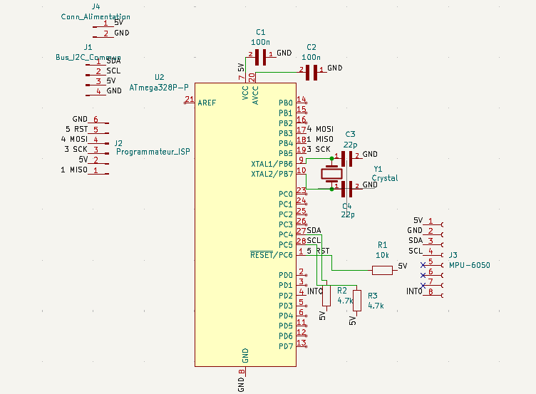
    *Fichier KiCad :* [`hardware/cube_pcb/cube_pcb.kicad_sch`](./hardware/cube_pcb/cube_pcb.kicad_sch)

* **Visualisation PCB 3D de la Boîte Noire :**
    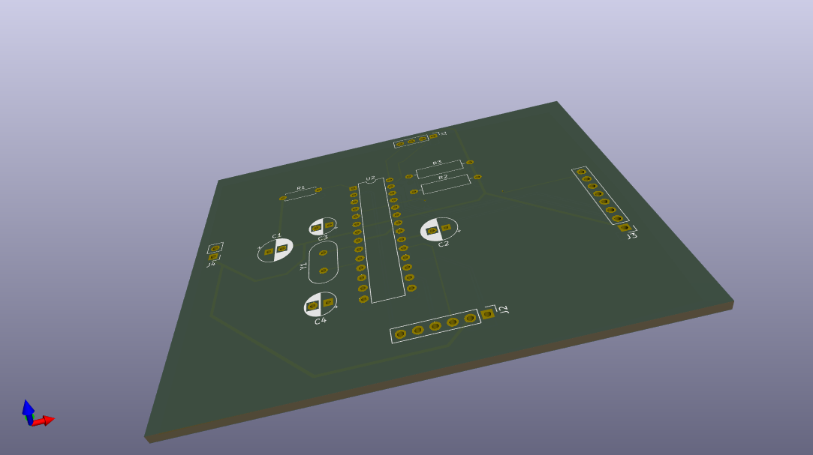
    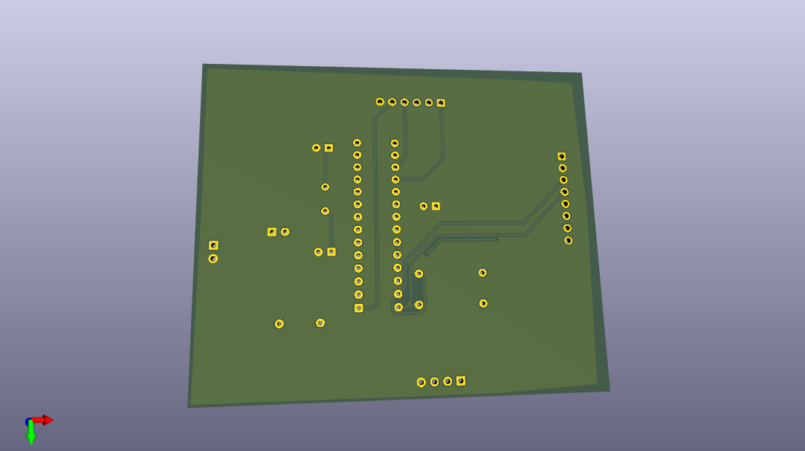
    *Fichier KiCad :* [`hardware/cube_pcb/cube_pcb.kicad_pcb`](./hardware/cube_pcb/cube_pcb.kicad_pcb)

* **Photo du Montage Prototypage (Optionnel, si disponible) :**
     #### **Téléversement du Firmware de la Boîte Noire**

1.  Ouvrez le fichier [`cube_firmware.ino`](./firmware/cube_firmware/cube_firmware.ino) dans l'Arduino IDE.
2.  Assurez-vous d'avoir sélectionné la bonne carte (ex: "Arduino Uno") et le bon port COM/USB.
3.  Cliquez sur "Téléverser" (bouton flèche droite) pour compiler et envoyer le code à votre microcontrôleur.

### **3. Assemblage du Module "Station de Contrôle"**

Le module "Station de Contrôle" comprend un microcontrôleur ATmega328P (ou carte Arduino Uno) et un écran LCD I2C.

#### **Schéma de Câblage (Prototypage sur Breadboard)**

Ce schéma illustre les connexions minimales pour le fonctionnement de la Station de Contrôle sur une plaque d'essai.

* **ATmega328P (sur carte Arduino Uno ou standalone)**
* **Écran LCD I2C**
    * `VCC` -> `5V`
    * `GND` -> `GND`
    * `SDA` -> `A4` (ou `SDA` dédié si ATmega328P nu)
    * `SCL` -> `A5` (ou `SCL` dédié si ATmega328P nu)

* **Schéma KiCad de la Station de Contrôle :**
    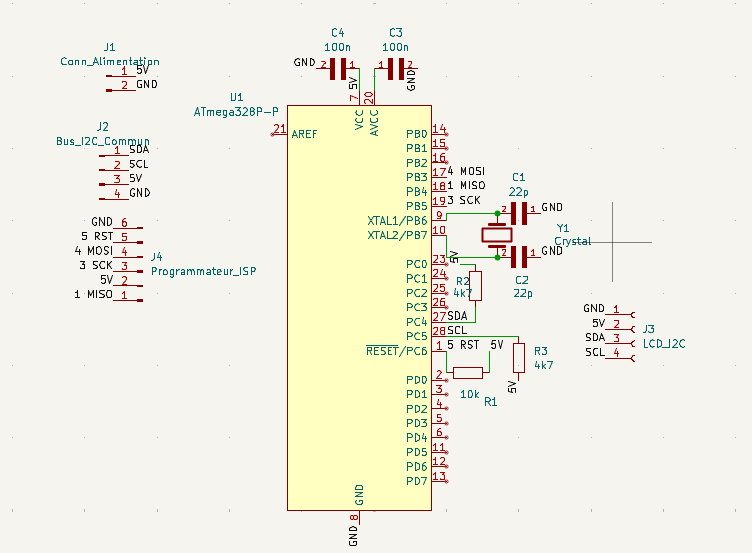
    *Fichier KiCad :* [`hardware/station_pcb/station_pcb.kicad_sch`](./hardware/station_pcb/station_pcb.kicad_sch)

* **Visualisation PCB 3D de la Station de Contrôle :**
    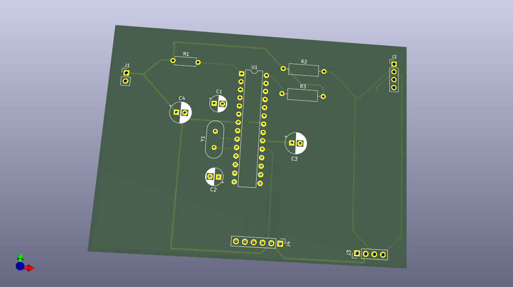
    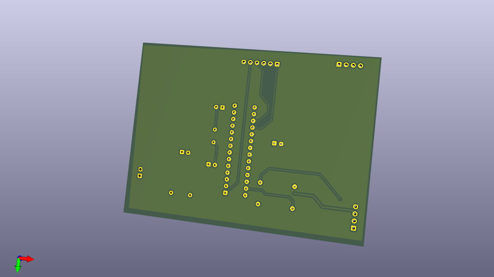
    *Fichier KiCad :* [`hardware/station_pcb/station_pcb.kicad_pcb`](./hardware/station_pcb/station_pcb.kicad_pcb)

* **Photo du Montage Prototypage (Optionnel, si disponible) :**
     #### **Téléversement du Firmware de la Station de Contrôle**

1.  Ouvrez le fichier [`station_firmware.ino`](./firmware/station_firmware/station_firmware.ino) dans l'Arduino IDE.
2.  Assurez-vous d'avoir sélectionné la bonne carte et le bon port COM/USB.
3.  Cliquez sur "Téléverser".

### **4. Configuration de l'Adresse I2C**

* Vérifiez que l'adresse I2C définie pour la Station de Contrôle dans le code (`STATION_ADDRESS`) correspond bien à celle utilisée par la Boîte Noire pour l'envoi de données. Par défaut, elle est fixée à `8`.
    ```cpp
    // Dans cube_firmware.ino et station_firmware.ino
    const int STATION_ADDRESS = 8;
    ```
    Si vous utilisez une carte Arduino Uno complète, les broches SDA (A4) et SCL (A5) sont généralement standard. Si vous utilisez l'ATmega328P seul, assurez-vous de connecter les broches A4 et A5 à SDA et SCL.

### **5. Alimentation des Modules**

* Les deux modules (Boîte Noire et Station de Contrôle) nécessitent une alimentation stable de 5V.
* Assurez-vous que les GND (masses) des deux modules sont interconnectées pour que la communication I2C fonctionne correctement.

---

## 🚀 Fonctionnement et Utilisation

Une fois assemblé et les firmwares téléversés sur chaque module, votre système "BlackBox & Control Station" est prêt à fonctionner. Suivez ce guide pour comprendre son comportement et interagir avec lui.

### **1. Démarrage du Système**

1.  **Alimentez les deux modules** (Boîte Noire et Station de Contrôle) simultanément ou en séquence. Assurez-vous que leurs masses (GND) sont interconnectées.
2.  La **Station de Contrôle** affichera brièvement "Station OK" sur l'écran LCD, puis passera en mode d'attente des données.
3.  La **Boîte Noire** initiera le MPU-6050 et commencera à acquérir les données. Si un crash a été détecté et enregistré précédemment, la Boîte Noire réinitialisera automatiquement l'état de crash dans l'EEPROM, préparant le système pour un nouveau vol. Vous verrez les messages de démarrage sur le moniteur série si vous êtes connecté.

### **2. Mode de Fonctionnement Normal**

En mode de fonctionnement normal, la Boîte Noire acquiert en continu les données d'orientation et d'accélération du MPU-6050 et les envoie à la Station de Contrôle.

* **Affichage sur la Station de Contrôle :** L'écran LCD de la Station de Contrôle affichera en temps réel les angles de Roulis (R:), de Tangage (P:) et l'Accélération sur l'axe Z (AccelZ:) mesurés par la Boîte Noire. Ces valeurs devraient changer en fonction des mouvements de la Boîte Noire.

    
    
### **3. Détection de Crash**

Le système est conçu pour détecter un impact significatif, simulant un crash, basé sur les données d'accélération du MPU-6050.

* **Déclenchement :** Lorsque l'accélération totale dépasse un seuil prédéfini (`CRASH_THRESHOLD_G` dans le firmware de la Boîte Noire, actuellement 8G), la Boîte Noire détecte un crash.
* **Comportement de la Boîte Noire :**
    * Le flag de crash est activé.
    * Les dernières données de vol pertinentes sont figées et stockées de manière permanente dans la mémoire EEPROM.
    * La Boîte Noire cesse d'enregistrer de nouvelles données de vol et entre dans un mode de récupération, attendant d'éventuelles commandes via le port série.
* **Comportement de la Station de Contrôle :**
    * Dès qu'elle reçoit le statut de crash de la Boîte Noire, l'écran LCD bascule pour afficher un message d'alerte clair : "!!! CRASH !!!" sur la première ligne et "DONNEES GELEES" sur la seconde.

     
    
### **4. Récupération des Données Post-Crash**

Après un crash, les données cruciales sont stockées dans l'EEPROM de la Boîte Noire. Elles peuvent être récupérées via une connexion série.

1.  **Connectez la Boîte Noire** à votre ordinateur via l'adaptateur USB vers Série (ou le câble USB de l'Arduino Uno).
2.  **Ouvrez le Moniteur Série** dans l'Arduino IDE (ou un terminal série de votre choix), en s'assurant que le débit en bauds est réglé à `9600`.
3.  **Envoyez la commande** exacte : `LIRE_DONNEES_CRASH` (suivi d'un retour chariot, assurez-vous que "Nouvelle ligne" est sélectionné dans les options du moniteur série).
4.  La Boîte Noire répondra en affichant les données enregistrées (Roll, Pitch, AccelZ) au format CSV, permettant une analyse ultérieure.

    

---

## ✅ Résultats et Démonstration

Ce projet a été rigoureusement testé pour valider ses fonctionnalités clés, de l'acquisition des données à la détection de crash et la récupération.

### **1. Tests Fonctionnels**

Des tests unitaires et d'intégration ont été réalisés pour chaque composant et chaque module. Les résultats détaillés de ces tests sont disponibles dans le dossier [`tests/results/`](./tests/results/).

* **Test de l'EEPROM (`eeprom_test`)** : Validation de la lecture et écriture non-volatile des données.
    * [Résultats du test EEPROM](./tests/results/eeprom_test/results.txt)
* **Test de Communication I2C (`i2c_master_to_slave`)** : Vérification de la transmission bidirectionnelle entre la Boîte Noire (Maître) et la Station de Contrôle (Esclave).
    * [Résultats du test I2C](./tests/results/i2c_master_to_slave/results.txt)
* **Test de l'Écran LCD I2C (`lcd_i2c_test`)** : Confirmation de l'affichage correct des informations.
    * [Résultats du test LCD I2C](./tests/results/lcd_i2c_test/results.txt)
* **Test du Capteur MPU-6050 (`mpu6050_test`)** : Vérification de l'acquisition précise des données d'accélération et de gyroscope.
    * [Résultats du test MPU-6050](./tests/results/mpu6050_test/results.txt)

### **2. Démonstration du Système Complet**

Les éléments les plus probants sont les visuels du système en action. Les vidéos et GIFs ci-dessous illustrent le comportement du "BlackBox & Control Station" dans ses différents états.

* **Démonstration du Mode Normal :** 
 Visualisez l'affichage dynamique des données de roulis, tangage et accélération Z sur l'écran de la Station de Contrôle en fonction des mouvements de la Boîte Noire.
    
* **Démonstration de la Détection de Crash :**
     Observez la transition de l'affichage de la Station de Contrôle en mode "!!! CRASH !!!" lors de la détection d'un impact.
     
 * **Démonstration de la Récupération des Données Post-Crash:**
     Illustration de la procédure de connexion et de l'envoi de la commande pour récupérer les données essentielles stockées dans l'EEPROM via le moniteur série.
     

  **Note :** Pour une démonstration complète et interactive, veuillez consulter la vidéo de présentation du projet (lien ci-dessous).

   **[Lien Vidéo de Démo YouTube / Viméo]** 

---

## 💡 Améliorations Possibles

Le système "BlackBox & Control Station" est fonctionnel et remplit ses objectifs initiaux. Cependant, plusieurs pistes d'amélioration peuvent être explorées pour accroître ses capacités, sa robustesse et sa convivialité.

### **1. Améliorations du Module Boîte Noire**

* **Gestion Avancée de l'EEPROM** : Implémenter une gestion plus sophistiquée du buffer circulaire EEPROM pour garantir l'intégrité des données même en cas de coupure de courant pendant l'écriture, ou pour ajouter des horodatages aux enregistrements.
* **Acquisition de Données Supplémentaires** : Intégrer d'autres capteurs (GPS pour la localisation du crash, baromètre pour l'altitude, capteur de température/humidité) pour enrichir les données de vol.
* **Optimisation de la Consommation Électrique** : Mettre en œuvre des modes de faible consommation pour prolonger l'autonomie de la Boîte Noire, essentielle pour des applications embarquées.
* **Précision de la Détection de Crash** : Affiner l'algorithme de détection de crash en utilisant des techniques de filtrage (filtre de Kalman, filtre complémentaire) pour le MPU-6050, ou en intégrant des seuils dynamiques.

### **2. Améliorations du Module Station de Contrôle**

* **Interface Utilisateur Enrichie** : Remplacer l'écran LCD par un écran graphique OLED ou TFT pour un affichage plus riche (graphiques, menus intuitifs, icônes).
* **Stockage des Données Reçues** : Ajouter une carte SD ou une EEPROM externe pour que la Station de Contrôle puisse enregistrer un historique des données reçues en temps réel, pas seulement après un crash.
* **Connectivité Étendue** :
    * Intégration d'un module Wi-Fi (ESP8266/ESP32) ou Bluetooth pour une communication sans fil avec un PC ou un smartphone, permettant une visualisation plus avancée ou une transmission à distance.
    * Mettre en place un serveur web embarqué sur l'ESP32 pour visualiser les données via un navigateur.
* **Alertes Sonores/Visuelles** : Ajouter un buzzer ou des LEDs pour des alertes plus visibles ou audibles en cas de crash.

### **3. Améliorations de la Communication et de la Robustesse**

* **Checksum/CRC pour l'I2C** : Ajouter un mécanisme de vérification d'erreurs (checksum ou CRC) aux paquets I2C pour assurer l'intégrité des données transmises.
* **Redondance des Capteurs** : Pour des applications critiques, envisager l'utilisation de multiples capteurs et une logique de fusion de données pour une plus grande fiabilité.
* **Boîtier et Fixation** : Concevoir et imprimer en 3D un boîtier robuste et compact pour chaque module, protégeant l'électronique et facilitant l'intégration dans un drone/robot.
* **Mise à jour FOTA (Firmware Over-The-Air)** : Si une connectivité Wi-Fi est ajoutée, permettre la mise à jour du firmware à distance pour faciliter la maintenance et les évolutions.

---

## ❓ Dépannage (FAQ)

Cette section regroupe les problèmes courants que vous pourriez rencontrer lors de l'assemblage, du téléversement ou de l'utilisation du système, ainsi que leurs solutions.

### **Problèmes de Téléversement du Firmware**

* **Q : Erreur "avrdude: ser_open(): can't open device" ou "Port non trouvé".**
    * **R :** Vérifiez que le bon port COM/USB est sélectionné dans l'Arduino IDE (`Tools > Port`). Assurez-vous que l'adaptateur USB vers Série (ou l'Arduino Uno utilisé comme programmeur) est correctement connecté et que les pilotes (ex: FTDI, CH340) sont installés sur votre ordinateur.
* **Q : Erreur "stk500_getsync(): not in sync: resp=0x00".**
    * **R :** Cela indique souvent un problème de communication entre l'IDE et le microcontrôleur.
        * Vérifiez que la bonne carte est sélectionnée (`Tools > Board`).
        * Assurez-vous que l'ATmega328P est correctement câblé pour le téléversement (y compris les connexions TX/RX, Reset).
        * Tentez de maintenir le bouton "Reset" enfoncé sur l'Arduino (ou de débrancher/rebrancher le GND sur l'ATmega nu) juste avant le début du téléversement (juste après la compilation).
* **Q : Le code compile mais rien ne se passe sur la carte.**
    * **R :** Vérifiez l'alimentation de la carte et les connexions `GND`. Si vous utilisez un ATmega328P seul, assurez-vous que le quartz 16 MHz et ses condensateurs 22 pF sont correctement connectés et que le bootloader est bien gravé.

### **Problèmes de Communication I2C**

* **Q : L'écran LCD de la Station de Contrôle reste vide ou affiche des carrés.**
    * **R :**
        * Vérifiez le câblage de l'écran LCD, en particulier SDA, SCL, VCC et GND.
        * Assurez-vous que le potentiomètre de contraste à l'arrière du module I2C de l'écran est correctement ajusté (tournez-le avec un petit tournevis).
        * Vérifiez l'adresse I2C de votre module LCD. L'adresse par défaut dans le code (`0x27`) est la plus courante, mais certains modules utilisent `0x3F`. Vous pouvez utiliser un sketch de "scanner I2C" (recherchez "Arduino I2C scanner" en ligne) pour trouver l'adresse réelle de votre LCD.
* **Q : La Station de Contrôle n'affiche pas de données ou affiche des valeurs erronées.**
    * **R :**
        * Assurez-vous que les broches SDA et SCL de la Boîte Noire et de la Station de Contrôle sont correctement connectées (SDA à SDA, SCL à SCL).
        * **Vérifiez que les masses (GND) des deux modules sont interconnectées !** C'est une erreur très courante en I2C.
        * Vérifiez que les firmwares des deux modules sont bien téléversés et correspondent aux versions attendues.
        * Confirmez que `STATION_ADDRESS` est identique dans les deux codes.
        * Les résistances de pull-up (4.7kΩ) sur SDA et SCL sont-elles présentes ? Elles sont souvent intégrées aux modules ou cartes Arduino, mais peuvent être nécessaires si vous utilisez l'ATmega nu.

### **Problèmes du Capteur MPU-6050**

* **Q : Le MPU-6050 ne renvoie pas de données ou affiche des valeurs fixes/erronées.**
    * **R :**
        * Vérifiez le câblage du MPU-6050 (VCC, GND, SDA, SCL, INT).
        * Confirmez l'alimentation (VCC) du MPU-6050. Certains modules sont en 3.3V, d'autres ont un régulateur 5V intégré.
        * Assurez-vous que l'adresse I2C du MPU-6050 est correcte (`0x68` ou `0x69` si la broche AD0 est tirée à HIGH). Le code utilise 0x68.

### **Problèmes de Détection de Crash et EEPROM**

* **Q : Le système ne détecte pas de crash ou détecte des "faux positifs".**
    * **R :** Le seuil de détection `CRASH_THRESHOLD_G` peut nécessiter un ajustement. C'est une valeur qui dépendra de la sensibilité souhaitée et du type d'impact que vous voulez simuler. Commencez par des valeurs plus basses et augmentez progressivement.
    * Vérifiez la stabilité du capteur. Des vibrations excessives en vol normal peuvent être interprétées comme des faux positifs.
* **Q : Les données ne sont pas sauvegardées en EEPROM ou les données récupérées sont corrompues.**
    * **R :**
        * Assurez-vous que vous utilisez la bibliothèque EEPROM standard d'Arduino.
        * Vérifiez la taille de votre `FlightData` struct et la gestion des adresses EEPROM dans le code. Les fonctions `EEPROM.put()` et `EEPROM.get()` gèrent automatiquement la taille de la structure, mais les adresses (`EEPROM_CRASH_FLAG_ADDR`, `EEPROM_CRASH_ADDR_ADDR`) doivent être correctement définies pour éviter les chevauchements.

---

## 👏 Conclusion

Le système "BlackBox & Control Station - IFRI" représente une solution complète et robuste pour l'acquisition, la surveillance et la récupération de données critiques en environnement embarqué. Développé avec rigueur pour le **Tekbot Robotics Challenge 2K25 - RESILIENCE**, il démontre notre expertise en électronique, programmation embarquée et communication inter-systèmes. Nous espérons que ce projet servira de base solide pour de futures explorations et innovations dans le domaine de la robotique et des systèmes embarqués.

---

## 📄 Licence

Ce projet est distribué sous la licence MIT. Vous êtes libre de l'utiliser, de le modifier et de le distribuer sous les termes de cette licence.

Pour plus de détails, consultez le fichier [`LICENSE`](LICENSE) à la racine de ce dépôt.